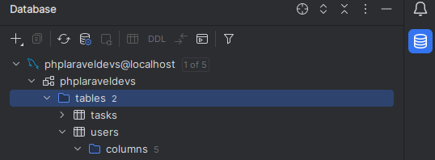
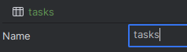
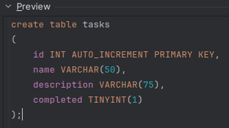
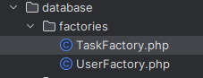
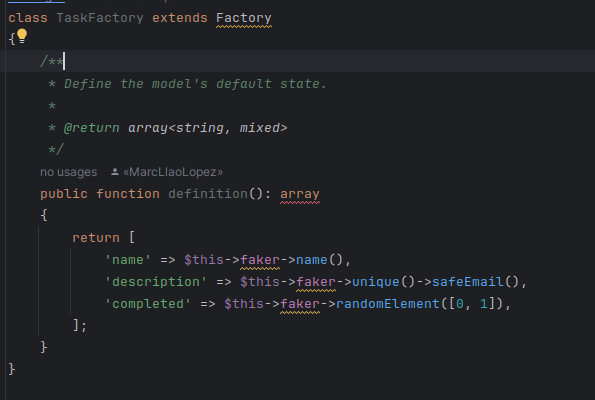
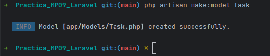
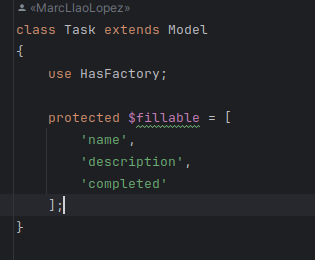
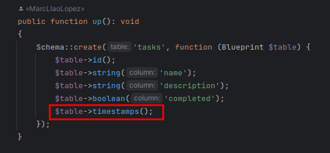
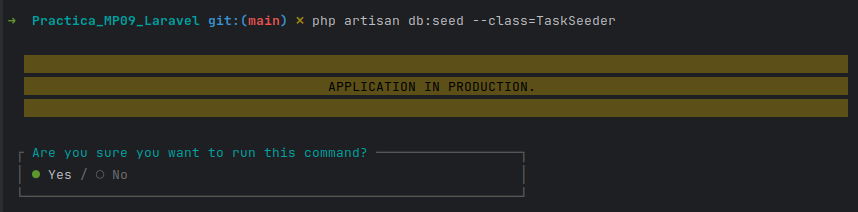

# Practica MP09

## Crear migració a la taula tasks. Ha de tenir els camps (id, name, description i completed)
El que farem serà anar a l'apartat de database i fer clic dret en l'apartat de tables

I afegirem una nova taula anomenada tasks

A la qual a la definició d'aquesta afegirem els camps id, name, description i completed

## Crear factory

Tindrem que crear un fitxer php anomenat TaskFactorie prenent com a referéncia el fitxer UserFactory,
simplement tindrem que copiar el fitxer i pegar

I el mostrem

## Crear model de tasks

El que farem primer serà crear el model de Task

I afegirem la següent linea

## Crear seed

Crearem la seed que servirà per a la taula Task que hem creat anteriorment

La qual tindrem que plenar amb el següent contingut

## Crear inserts a partir del seed

Afegim la linea següent dins de **database/migrations/2023_12_19_190450_tasks.php**

Farem us de la següent comanda

## Crear controlador de tasks

## Crear ruta a routes/web.php i afegir la nova ruta al navegador al fitxer resources/views/components/layout.blade.php crear la vista tasks.blade.php

Documentar en captures i comprovació de inserts de tasks i users
